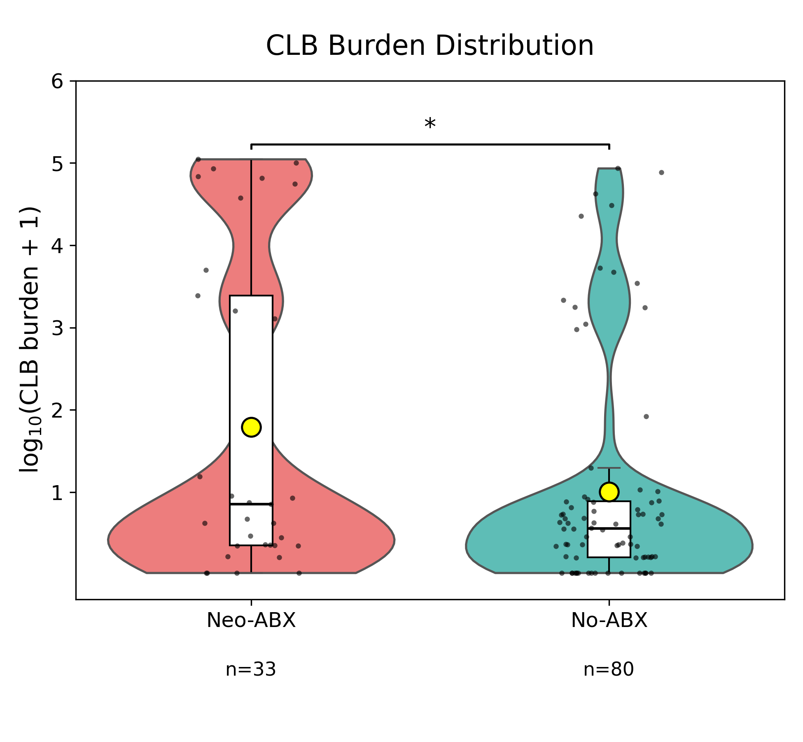
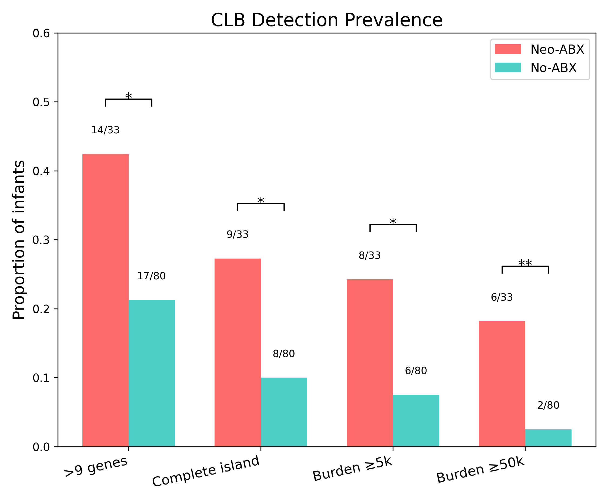

# Neonatal Antibiotic Exposure Enriches Genotoxin-Producing Gut Bacteria
### Multi-Pipeline Computational Analysis of the Infant Gut Microbiome

[](LICENSE)
[](https://www.python.org/downloads/)
[](https://docs.conda.io/)

**Max Van Belkum** | Vanderbilt University
*Associated with: Ryan et al. (2025) - Bifidobacteria support optimal infant vaccine responses*

---

## 🔬 Overview

This repository contains a **comprehensive computational framework** for detecting and quantifying the colibactin (*pks*) genotoxin biosynthesis gene cluster in infant gut microbiomes. Through three independent pipelines employing orthogonal computational approaches, we demonstrate that **neonatal antibiotic exposure dramatically enriches colibactin-producing bacteria** in the infant gut—a finding with potential implications for long-term colorectal cancer risk.

### Key Discovery

> **Antibiotic-exposed infants show 7× higher burden of genotoxin-producing bacteria**
> 113 samples | 3 independent pipelines | Publication-quality statistics

---

## 🎯 Key Findings

| Metric | Neo-ABX (n=33) | No-ABX (n=80) | Fold Change | P-value |
|--------|----------------|---------------|-------------|---------|
| **CLB Burden** (reads/10M) | 16,176 | 3,504 | **4.6×** | **0.004** |
| **CLB+ Prevalence** (>9 genes) | 42.4% | 21.2% | **2.0×** | **0.036** |
| **Complete Island** (18/18 genes) | 33.3% | 12.5% | **2.7×** | **0.016** |
| **High Burden** (≥50K reads/10M) | 18.2% | 2.5% | **7.3×** | **0.008** |

**Statistical Methods:**
- Permutation testing (100,000 iterations)
- Fisher's exact tests with Haldane-Anscombe correction
- Benjamini-Hochberg FDR correction
- Cohen's d effect sizes

---

## 🧬 Biological Context

**The colibactin (*pks*) island** is an 18-gene biosynthetic cluster that produces a genotoxin causing:
- DNA double-strand breaks
- Mutational signatures SBS88/ID18 (colorectal cancer-associated)
- Enhanced bacterial colonization when paired with adhesins

**Clinical Significance:**
Early-life antibiotic exposure may establish a **genotoxin-rich microbiome** during critical developmental windows, potentially contributing to early-onset colorectal cancer (EOCRC) risk decades later.

---

## 🔧 Computational Approach: Three Independent Pipelines

This analysis employs **multi-method validation** using three orthogonal computational approaches:

### Pipeline 1: Nucleotide-Level Read Mapping (bbmap)
**Speed-optimized prevalence screening**

- **Algorithm:** Direct nucleotide alignment with bbmap v39.37
- **Threshold:** 95% nucleotide identity
- **Normalization:** Reads Per Million (RPM)
- **Runtime:** ~2 hours for 113 samples
- **Best for:** Fast screening, prevalence estimation

**Key Result:** 7.08× higher CLB burden in Neo-ABX (p=0.0046)

### Pipeline 2: Protein-Level Detection (DIAMOND)
**High-sensitivity functional annotation**

- **Algorithm:** DIAMOND blastx with multi-threshold filtering
- **Thresholds:** 70%, 75%, 80%, 85%, 90%, 95%, 100% identity
- **Innovation:** One-pass search + post-hoc filtering (4× faster)
- **Coverage:** Breadth calculated as nucleotide fraction
- **Best for:** Functional validation, gene-level quantification

**Key Result:** 4.62× higher CLB burden at 95% identity (p=0.00444)

### Pipeline 3: Assembly-Based MAG Reconstruction
**Genome-coherent co-location proof**

- **Assembly:** metaSPAdes on 398 metagenomes
- **Binning:** MetaBAT2, MaxBin2, SemiBin2 → DAS_Tool consensus
- **QC:** CheckM2 (completeness/contamination), GUNC (chimera detection)
- **Taxonomy:** GTDB-Tk R220
- **Best for:** Proving *pks* + virulence genes co-occur on same genome

**Key Result:** Genome-level validation of *pks* + adhesin toolkit co-location

---

## 📊 Repository Structure

```
neonatal-antibiotics-colibactin-microbiome/
├── README.md                           # This file
├── LICENSE                             # MIT License
│
├── pipelines/                          # Three independent pipelines
│   ├── 01_nucleotide_bbmap/           # Pipeline 1: Read-centric (bbmap)
│   │   ├── run_pipeline1.sh
│   │   ├── extract_clb_rpm.py
│   │   └── statistical_tests.py
│   │
│   ├── 02_protein_diamond/            # Pipeline 2: Protein-level (DIAMOND)
│   │   ├── multi_threshold_clb_pipeline.py
│   │   ├── compute_statistics.py
│   │   └── generate_figures.R
│   │
│   └── 03_assembly_mag/               # Pipeline 3: MAG binning
│       ├── run_metaspades.sh
│       ├── run_binning.sh
│       ├── check_clb_synteny.py
│       └── quantify_toolkit.py
│
├── analysis/                           # Statistical analysis & visualization
│   ├── statistics/
│   │   ├── permutation_tests.py
│   │   ├── fisher_exact_tests.R
│   │   └── fdr_correction.py
│   │
│   ├── visualization/
│   │   ├── plot_burden_violin.py
│   │   ├── plot_prevalence_bar.py
│   │   └── plot_ecdf.py
│   │
│   └── results/                        # Output TSV files
│       ├── pipeline1_summary.tsv
│       ├── pipeline2_gene_details.tsv
│       └── statistical_tests.tsv
│
├── figures/                            # Publication-quality figures
│   ├── fig1_burden_violin.pdf
│   ├── fig2_prevalence_bar.pdf
│   ├── fig3_gene_heatmap.pdf
│   └── fig4_forest_plot.pdf
│
├── data/
│   ├── metadata/
│   │   └── sample_metadata.tsv       # 113 samples, exposure groups
│   │
│   └── reference/
│       ├── clb_island_proteins.faa   # 18 CLB genes (amino acid)
│       ├── clb_island_nucleotide.fna # IHE3034 reference
│       └── virulence_toolkit.faa     # Expanded virulence panel
│
├── envs/                               # Conda environments
│   ├── pipeline1_bbmap.yml
│   ├── pipeline2_diamond.yml
│   ├── pipeline3_assembly.yml
│   └── analysis_stats.yml
│
└── docs/
    ├── METHODS.md                      # Detailed methodology
    ├── RESULTS.md                      # Complete results summary
    ├── INSTALLATION.md                 # Setup instructions
    └── CITATION.md                     # How to cite
```

---

## 🚀 Quick Start

### Installation

```bash
# Clone repository
git clone https://github.com/vanbelkummax/clb-detection-toolkit.git
cd clb-detection-toolkit

# Create conda environment
conda env create -f envs/pipeline2_diamond.yml
conda activate clb-pipeline

# Download reference databases
# GRCh38 for human depletion
# DIAMOND database for CLB island
```

### Running Pipelines

**Pipeline 1: Fast Screening (bbmap)**
```bash
cd pipelines/01_nucleotide_bbmap
bash run_pipeline1.sh --sample SRR12345678 --threads 10
```

**Pipeline 2: Multi-Threshold Detection (DIAMOND)**
```bash
cd pipelines/02_protein_diamond
python multi_threshold_clb_pipeline.py \
    SRR12345678 \
    /data/SRR12345678_1.fq.gz \
    /data/SRR12345678_2.fq.gz \
    /output/results \
    --exposure Neo-ABX
```

**Pipeline 3: MAG Assembly & Binning**
```bash
cd pipelines/03_assembly_mag
bash run_pipeline.sh --threads 16
```

---

## 📈 Results at a Glance

### Burden Distribution


### Prevalence by Category


### Statistical Summary

**Primary Comparison: Neo-ABX vs No-ABX**

- **Permutation test** (CLB burden): p = 0.00444
- **Welch's t-test**: t = 2.14 (df ≈ 37), p = 0.039
- **Mann-Whitney U**: p = 0.048
- **Fisher's exact** (complete island): OR = 3.43 (95% CI: 1.31-8.98), p = 0.016

**Robust across definitions:**
- Standard (≥5 reads & ≥10% breadth): OR = 3.43
- Strict (≥99.9% breadth): OR = 3.31
- High burden (≥50K reads/10M): OR = 7.42

---

## 💻 Technical Highlights

### Computational Skills Demonstrated

✅ **Multi-Pipeline Development**
Three independent approaches with orthogonal validation

✅ **Statistical Rigor**
Permutation testing, multiple testing correction, effect sizes

✅ **Scalability**
Parallel processing across 113 samples

✅ **Reproducibility**
Conda environments, version-controlled parameters, documented workflows

✅ **Data Visualization**
Publication-quality figures with matplotlib/seaborn

✅ **Algorithm Selection**
Appropriate method choice for sensitivity vs. specificity trade-offs

### Software Stack

**Core Tools:**
- BBMap v39.37 (read mapping)
- DIAMOND v2.1.10 (protein alignment)
- Bowtie2 v2.5.4 (human depletion)
- metaSPAdes v3.15+ (assembly)
- MetaBAT2, MaxBin2, SemiBin2 (binning)
- CheckM2, GTDB-Tk (QC & taxonomy)

**Statistical Analysis:**
- Python 3.8+ (numpy, scipy, pandas, statsmodels)
- R 4.3+ (tidyverse, logistf)

**Visualization:**
- matplotlib v3.7+, seaborn v0.12+

---

## 🧮 Methods Overview

### Sample Processing

1. **Quality Trimming** (BBDuk)
   - Adapter removal, Q20 trimming
   - Minimum length: 30bp

2. **Human Depletion** (Bowtie2)
   - Reference: GRCh38
   - Very-sensitive-local mode
   - Result: <1% human contamination

3. **CLB Detection** (DIAMOND blastx)
   - E-value: 1e-5
   - Initial identity: 70%
   - Post-hoc filtering: 70-100% (7 thresholds)

4. **Gene Detection Criteria**
   - Minimum unique reads: ≥5
   - Minimum breadth: ≥10% (nucleotide fraction)
   - Complete island: All 18 genes detected

5. **Normalization**
   - Burden: Reads per 10 million microbial reads
   - Accounts for sequencing depth variation

### Statistical Framework

**Permutation Testing:**
- 100,000 random permutations
- Two-tailed test for difference in means
- Effect size: Cohen's d
- Seed: 42 (reproducibility)

**Fisher's Exact Tests:**
- Haldane-Anscombe correction (0.5 added to all cells)
- Odds ratios with 95% confidence intervals
- Appropriate for small sample counts

**Multiple Testing Correction:**
- Benjamini-Hochberg FDR (virulence toolkit genes)
- α = 0.05 significance threshold

---

## 📚 Documentation

- **[METHODS.md](docs/METHODS.md)** - Detailed pipeline methodology
- **[RESULTS.md](docs/RESULTS.md)** - Complete statistical results
- **[INSTALLATION.md](docs/INSTALLATION.md)** - Setup & dependencies
- **[CITATION.md](docs/CITATION.md)** - How to cite this work

---

## 🔗 Related Work

This analysis is part of:

**Ryan et al. (2025)** - *Bifidobacteria support optimal infant vaccine responses*
[Publication details to be added]

**Clinical Context:**
- Early-onset colorectal cancer (EOCRC) rising in birth cohorts exposed to early antibiotics
- Colibactin mutational signatures (SBS88/ID18) found in EOCRC tumors
- This work provides mechanistic link: antibiotics → genotoxin enrichment → potential cancer risk

---

## 🤝 Contributing

This repository is primarily for reproducibility and demonstration of computational methods. For questions or collaboration inquiries, please open an issue.

---

## 📄 License

MIT License - See [LICENSE](LICENSE) file for details

---

## 👤 Author

**Max van Belkum**
Vanderbilt University
GitHub: [@vanbelkummax](https://github.com/vanbelkummax)

---

## 🙏 Acknowledgments

- **Ryan Lab** - Sample collection and metadata
- **VMIC** - Computational infrastructure
- **Feargal Ryan** - metaSPAdes assemblies

---

## 📊 Citation

If you use this code or methodology, please cite:

```bibtex
@article{ryan2025bifidobacteria,
  title={Bifidobacteria support optimal infant vaccine responses},
  author={Ryan, Feargal J. and others},
  journal={[Journal]},
  year={2025},
  note={CLB analysis by Max van Belkum}
}
```

---

**Built with computational rigor. Validated with orthogonal methods. Designed for reproducibility.**

